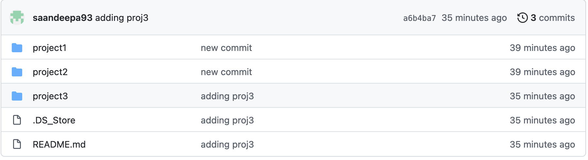
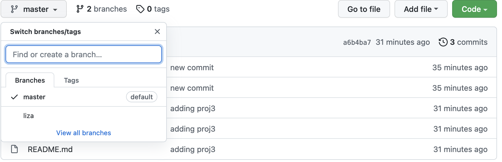

# **Continuous Authentication Project**

### *This repo maintains the codebase involved in CA project. The repo should always contain the latest code for individual application. The detailed process to clone the repo for the first time and commit multiple projects is given below*

## **Add your project for the first time.**
  * You guys might have written multiple projects till now (for example liza has a `netbeans` app for the laptop as well as a `keylogger` mobile app for the phone). Due to this, you might need to add them as separate directories in git repo.

  
  
  * To do this, create a new directory `parent_dir` and copy all your projects under this directory. Then go to the parent directory of the first project you want to push. For example, if your projects contain `parent_dir/netbeans_app` and `parent_dir/keylogger`, cd into `parents_dir` directory.
  
  * Initialize git repo using the below command.
  ```
  cd parent_dir
  git init
  git remote add origin <link>
  git checkout --orphan <new_branch_name>
  ```
  * `<new_branch_name>` should preferrably be your name. At this point, you would have created a new branch which is totally independent of other branches (hence `--orphan`), you can check here.

  

  * All you need to do now is add your projects to this new branch

  ```
  git add .
  git commit -m "initial commit"
  git push origin <new_branch_name>
  ```

## **Subsequent commits**

  * Use your current local directory from now on to make any changes. To commit your changes after the initial setup, simply follow the below set of commands.

  ```
  git add .
  git commit -m <commit message>
  git push origin <new_branch_name>
  ```

